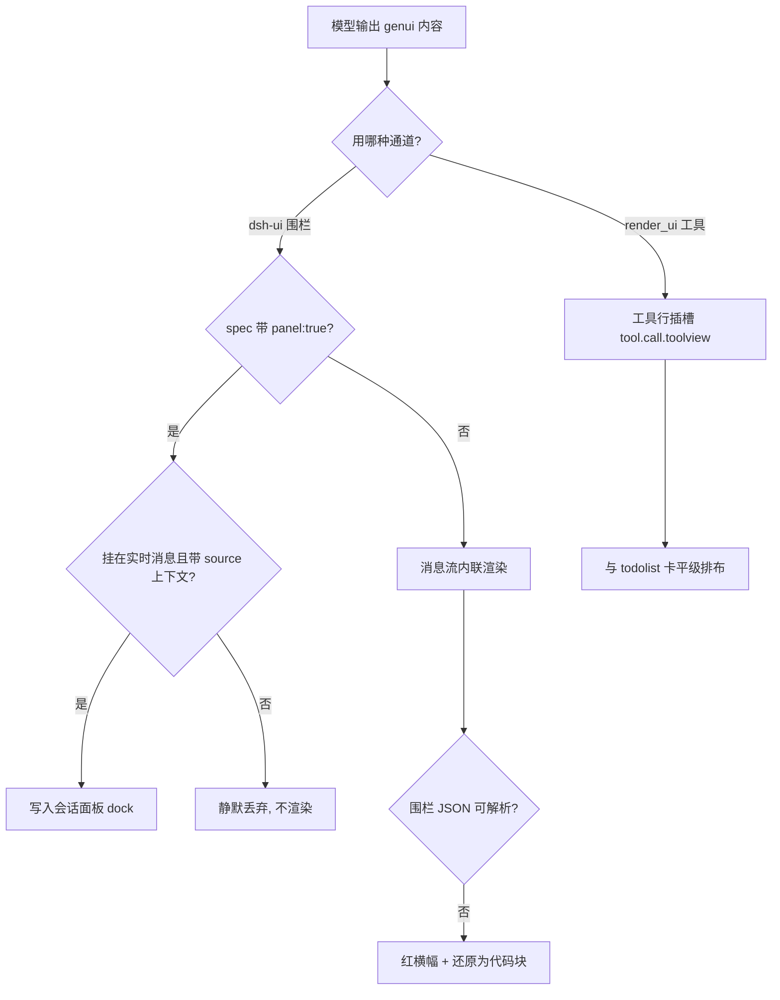

# GenUI 使用手册

> 版本：v1.0 ｜ 适用：DeepSeek Harness Web GUI（dsh web）
> 依据：genui 技能规范（SKILL.md）+ `@changfenhuang/dsh-genui` 客户端实现源码验证（lib/client.js、lib/index.js）

---

## 1. 概览

GenUI 是 DSH 的**生成式 UI** 系统：模型在回答中输出一段 JSON 规格（spec），GUI 把它渲染成真实可交互的组件——表格、图表、表单、流程图、3D 场景等，且支持状态持久化与判题等本地行为。

核心原则：

1. **组件服务内容**——结构化表达优于纯文本时主动用（要点、强调、对比、流程、数据、演示）；一句话能说清的事不套 UI。
2. **一个主题一个主组件**——同一批数据不要既画 bars 又画 donut。
3. **本地优先**——UI 自己能做的（判卷、折叠、排序、判题、重置）就地完成，零模型往返。
4. **JSON 必须严格合法**——坏围栏会降级为代码块。

---

## 2. 三种输出通道（重点）

同一条 spec，走哪个通道决定了它**渲染在哪里**。这是"组件有时出现在插槽、有时出现在消息流"的唯一原因。

| 通道 | 触发方式 | 渲染位置 | 典型场景 |
|---|---|---|---|
| ① 消息围栏 | 回答中写 ```` ```dsh-ui ```` 围栏 | 消息流内联（`conversation.chat.node`） | 报告、演示、说明、巡展 |
| ② 工具卡片 | 模型调用 `render_ui` 工具（spec 作参数） | 工具行插槽 `tool.call.toolview`（与 todo 卡平级） | 交付物型面板、仪表盘、表单 |
| ③ 面板 dock | 围栏 spec 根节点带 `"panel": true` | 会话面板 dock（原地 replace / append） | 常驻面板、会话级工具 |

### 2.1 判定流程（源码确认）



### 2.2 源码事实（lib/client.js）

- **三层修复解析**：`lr` 取围栏 JSON 文本 → `B`/`Fr`/`Ir` 逐层自动修复标点级错误（半角引号、尾随逗号、缺括号）→ 都失败返回 `null`。
- **失败兜底 `Rr`**：显示红横幅"dsh-ui fence JSON 解析失败"并把围栏还原为代码块——**组件不会出现**。
- **面板写入 `zr` → `vr`**：`{sessionId, sourceId, order, mode: append|replace, spec}`；超出 200 节点/200 次追加返回 `overflow`，触发重建（replace）。
- **panel 围栏的丢弃条件**：`panel===true` 但**没有 source 上下文时（如历史重放、子代消息）渲染为空**——这是"看起来没插入"的常见原因。
- **状态持久化 stateKey**：`sessionId + source.id + spec JSON 指纹`；相同内容重渲染保留用户状态，新内容重置。

### 2.3 操作提示

- 想让界面固定在插槽区（与 todolist 平级）→ 对模型说「以工具卡片形式展示」→ 模型会调用 `render_ui` 工具。
- 想让界面跟随回答走 → 默认 ```` ```dsh-ui ```` 围栏即可。
- 想让面板常驻输入框上方 → 要求模型发 `"panel": true` 的围栏。

---

## 3. 组件词汇表

### 3.1 布局

| 组件 | 用途 | 关键字段 |
|---|---|---|
| `text` | 文本/标题 | `size`: h1\|h2\|h3\|body\|muted\|caption |
| `row` / `col` | 横向/纵向排列 | `items`, `wrap`, `spacer`, `gap` |
| `grid` | 网格 | `cols`, `items` |
| `card` | 卡片容器 | `title`, `items` |
| `divider` / `spacer` | 分隔 / 留白 | — |

### 3.2 展示

| 组件 | 用途 | 关键字段 |
|---|---|---|
| `stat` | 指标数字 | `label`, `value`, `delta`（`+` 绿 / `-` 红） |
| `badge` | 状态标签 | `label`, `tone`: success\|warn\|danger\|accent, `icon` |
| `progress` | 进度条 | `label`, `value`(0-100), `valueLabel` |
| `list` | 行式列表 | `items`: 字符串 或 `{title, desc}`，可嵌套节点 |
| `table` | 可排序表格 | `columns`, `rows`；表头点击本地排序，数值感知（千分位、% 可按真实值比较） |
| `keyvalue` | 键值对 | `pairs: [{key, value}]` |
| `timeline` | 时间线 | `items: {title, desc, time}` |
| `steps` | 步骤条 | `current`, `steps: {title, desc}` |
| `breadcrumb` | 面包屑 | `items: [字符串]` |
| `avatar` | 头像 | `name`, `color` |
| `file-tree` | 文件树（可折叠） | `items: {name, type: file\|dir, children}` |
| `callout` | 提示块 | `tone`: info\|success\|warning\|error, `title`, `content` |
| `json` | JSON 树查看器 | `value` |
| `code` | 代码块 | `lang`, `code` |
| `diff` | 差异对比 | `diffs: {path, oldText, newText}` |
| `copy` | 一键复制 | `label`, `text` |
| `audio` / `video` | 媒体播放 | `src`（仅 http(s) 或同源相对路径）；不自动播放 |

### 3.3 图表

| 组件 | 用途 | 关键字段 |
|---|---|---|
| `chart` | 轻量图表 | `kind`: bars\|line\|donut；`data: {label, value, color?}` |
| `echart` | ECharts 全功能 | `preset`: bar\|line\|area\|pie\|scatter 或 `option` 原生配置（函数会被过滤） |
| `plot` | 函数曲线 | `series: {expr, params 滑块, animateTo 动画}`；`xMin`/`xMax` |

### 3.4 交互

| 组件 | 用途 | 关键字段 |
|---|---|---|
| `button` | 按钮 | `label`, `tone`, `action`（**无 action 渲染为禁用**） |
| `input` | 单行输入 | `label`, `id`, `value`, `action`（失焦/回车触发） |
| `textarea` | 多行输入 | `label`, `id`, `rows`, `action`（失焦/Ctrl+Enter 触发） |
| `select` | 下拉 | `options`, `selected`, `id`, `action` |
| `slider` | 数值滑块 | `min`, `max`, `step`, `value`, `id`, `action` |
| `checkbox` / `switch` | 开关 | `checked`, `action` |
| `radio` | 单选 | `options`, `selected`, `action`；加 `group` 进本地聚合模式；加 `answer`+`explanation` 支持本地判卷 |
| `submit` | 提交/交卷 | `label`, `action`, `groups`（列全部题号），`resetAction` |
| `tabs` / `accordion` | 切换/折叠 | `tabs: {label, items}` / `items: {title, items}` |
| `quiz` | 教学问答 | `question`, `options: {label, correct?, feedback?}`, `explanation`, `id`, `action?` |

### 3.5 高级

| 组件 | 用途 | 关键字段 |
|---|---|---|
| `mermaid` | 自动布局图 | `code`（flowchart/sequence/class/gantt/pie/er/state/journey） |
| `diagram` | 编辑级品牌图 | `kind`（27 种，如 architecture/data-flow/process），坐标类用 x/y/w/h 精确定位；≤9 节点 / ≤12 边 |
| `scene3d` | 3D 场景 | `meshes`（1–5 个）：box/sphere/cone/cylinder/torus；可拖拽旋转 |

---

## 4. 交互机制

### 4.1 action 往返

带 `action` 的控件交互后回传 `[genui-action]`（含组件类型、值、id），模型收到后**重渲染更新后的界面**。适合必须模型参与的事（新内容、执行动作、下一步建议）。

### 4.2 本地零往返（不要回传的动作）

- `radio` 加 `group`：选择只本地记录，不发往返。
- `quiz`：点选即判题、可重试。
- `submit` + 题带 `answer`：交卷本地判分（✓/✗ + 解析）、锁定题目，「重新作答」本地重置。
- `file-tree` 折叠、`table` 表头排序、`tabs`/`accordion` 切换——全部本地。

### 4.3 状态持久化

按「会话 + 内容指纹」自动保存：刷新/重开会话，同一块 UI 的状态原样恢复；重渲染**相同内容**保留用户状态，渲染**新内容**自动从头开始。带 `id` 的输入值刷新后保留并被 submit 的 `fields` 收集。

### 4.4 卷子模式编排

每题一个 `radio`（唯一 `group` + `answer` + `explanation`）+ 末尾一个 `submit`（`groups` 列出全部题号）→ 用户全部选完交卷，**分数当场显示**，不用等模型。

### 4.5 面板（Panel）规则

- `"panel": true` 只渲染进会话面板 dock 并原地更新；`"append": true` 追加合并（同标签 tabs 追加/新标签加入/尾部追加）。
- 上限：200 节点 / 200 次追加，满了发 `replace` 重建。
- 面板组件来的 `[genui-action]` 只回一个 `panel:true` 围栏 + 至多一行 10 字内确认。

---

## 5. JSON 规范与自检

发出 ```` ```dsh-ui ```` 围栏前 4 步自检：

1. **括号配对**：`{}` 与 `[]` 数量相等，收尾序列逐个核对（长表格最易错：`]]}]}` 写成 `]}]}]`）。
2. **无尾随逗号**。
3. **值内引号用中文引号**（`“”`/`「」`）——半角 `"` 是头号错误。
4. **最后一个字符必须是 `}`**。

其他铁律：

- 一个组件的 **action 字段**不加则按钮禁用、控件不可交互（或视为纯展示）。
- **规模预算**：整棵树 ≤200 节点、嵌套 ≤8 层；3D mesh 1–5 个；plot 给合理 xMin/xMax；diagram ≤9 节点/≤12 边。
- **先验后发**：spec ≥3 个组件或含 `table` 时，先用 `validate_dsh_ui` 工具验证；❌ 修好再发；若回复附「已自动修复」JSON 直接照抄。
- 插件只修标点级小错（字符串内半角引号、尾随逗号）；**缺括号/错括号等结构错误不修**，直接红横幅降级。
- 不要在 JSON 字符串里放 markdown；超长表格拆成多个组件分开发。
- 不要嵌套围栏（dsh-ui 里不要再包 ``` 代码围栏）。

---

## 6. 常见问题（FAQ）

**Q1：组件为什么有时出现在插槽区（与 todolist 平级），有时出现在消息流？**
A：通道决定。`render_ui` 工具 → 工具行插槽 `tool.call.toolview`；` ```dsh-ui ```` 围栏 → 消息流内联。不是随机行为。

**Q2：`panel: true` 的围栏为什么没显示？**
A：panel 围栏只在有 source 上下文的实时消息上写入面板；历史重放、子代消息或缺少 session/source 时被**静默丢弃**（源码返回空 Fragment）。

**Q3：出现「dsh-ui fence JSON 解析失败」红横幅怎么办？**
A：JSON 损坏且三层修复无效。请模型修复后重发；结构类错误（缺括号、错位）不会自动修复。

**Q4：为什么按钮点了没反应？**
A：组件没带 `action`（无 action 的按钮渲染为禁用态）。

**Q5：刷新页面后输入值还在/状态恢复了？**
A：状态持久化按「会话 + 内容指纹」保存，这是设计行为；渲染新内容才会重置。

**Q6：为什么我的自定义图表没出现？**
A：只允许白名单组件类型；未知 type 会被忽略/报错；坏 spec 会降级为代码块。

---

## 7. 速查：内容 → 组件映射

| 内容 | 首选组件 |
|---|---|
| 关键结论 / 要点（≥2 条） | `list`、`keyvalue`、`callout` |
| 强调 / 警告 | `callout`、`badge`、`stat` |
| 数据对比 / 趋势 / 占比 | `table`、`chart`、`echart` |
| 关键指标 / 进度 | `stat`、`progress`、`badge` |
| 流程 / 步骤 / 时间线 | `steps`、`timeline`、`mermaid` |
| 架构 / 拓扑 / 数据流 | `diagram`（编辑级；自动布局才用 mermaid） |
| 目录 / 文件结构 | `file-tree`、`mermaid`、`accordion` |
| 代码 / 改动对比 | `code`、`diff`、`json` |
| 数学曲线 | `plot`（可带滑块、动画） |
| 3D / 空间 | `scene3d`（mesh 1–5） |
| 需要用户操作 | `input`、`select`、`radio`、`button`、`submit` |
| 教学 / 自测 | `quiz`、卷子模式（radio+submit 本地判分） |

**别用的情况**：一句话能说清的事、纯闲聊、用户明确不要 UI、为炫技硬塞组件。

---

## 8. 最小完整示例

````markdown
```dsh-ui
{"title":"今日 Token 报告","gap":12,"items":[
  {"type":"stat","label":"总消耗","value":"2,128,830","delta":"-93.3%"},
  {"type":"chart","kind":"donut","data":[
    {"label":"缓存命中","value":1843456,"color":"#4c8dff"},
    {"label":"新输入","value":271826,"color":"#2fbf71"}
  ]},
  {"type":"callout","tone":"info","title":"口径","content":"按请求时间戳归属到本地时区当日 0 点。"}
]}
```
````

三点提醒：① 先 `validate_dsh_ui` 再发；② 让面板进插槽就说「用工具卡片」，用 `render_ui`；③ 依赖模型侧选择通道时，直接把要求写进提示词。
