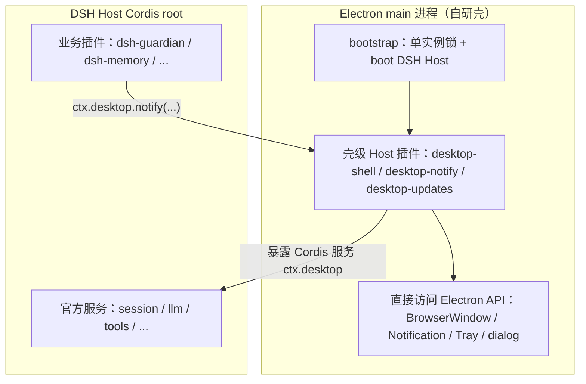
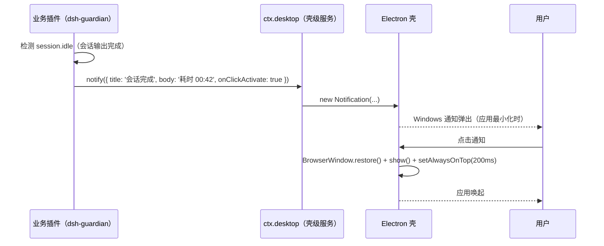

# SSiD 壳级能力设计（DSH × 壳协同层）

> 日期：2026-08-16
> 状态：设计补充（补技术设计方案「壳」章缺失的一层）
> 核心洞察：**有些能力是「DSH 插件 + 壳」协同才能实现的，单靠 DSH 插件做不到**——因为它们需要操作系统 / 窗口层的能力。

---

## 一、问题：为什么单靠 DSH 插件做不到

DSH 插件运行在 DSH host 进程里，只通过 Cordis `ctx` 访问服务，**碰不到** Electron / 操作系统层的 API：

| 要做的能力 | 卡在哪 |
|---|---|
| 会话完成时弹 Windows 通知 | 需要 `Notification`（Electron 主进程 API） |
| 点击通知唤起最小化的应用 | 需要 `BrowserWindow.restore/show` |
| 最小化到托盘、托盘角标 | 需要 `Tray` |
| 工作区切换新开窗口 | 需要 `new BrowserWindow` |
| 自动更新下载/安装 | 需要 `electron-updater` |
| 原生文件选择对话框 | 需要 `dialog` |

这些都不是"再加一个 DSH 插件"能解决的，而是**壳层的职责**。

## 二、架构：壳级 Host 插件 + 服务桥

自研壳不只是一个"窗口容器"，它是 **Electron main 进程 + 一组「壳级 Host 插件」**：



关键：**壳级能力以 Host 插件形式提供，通过 Cordis 服务（`ctx.desktop`）暴露给业务插件**。业务插件不需要 import Electron，只需声明 `inject: ['desktop']`。

（参考 anywhere-labs 的 `desktopProfiles`/`desktopPnpm` 服务，同构思路，但 SSiD 自研、覆盖更全。）

## 三、壳级能力清单

| # | 能力 | 壳层实现 | DSH 侧感知/触发 | fractal 对应功能 |
|---|---|---|---|---|
| 1 | 系统通知 | `Notification` | 业务插件检测事件 → `ctx.desktop.notify` | 回合完成通知、审批提醒 |
| 2 | 点击通知唤起窗口 | `BrowserWindow.restore/show/setAlwaysOnTop` | 壳监听通知点击 | 回合完成体验（点击通知回应用） |
| 3 | 托盘 + 角标 | `Tray` | 业务插件 → `ctx.desktop.setTrayBadge` | 引擎状态指示、activity 状态点 |
| 4 | 新开窗口 | `new BrowserWindow` | 业务插件 → `ctx.desktop.createWindow` | 工作区管理（非当前项新开窗口） |
| 5 | 引擎重启 | 重启 serve 子进程 | `ctx.desktop.refreshEngine` | 数据模式切换、崩溃恢复 |
| 6 | 自动更新 | `electron-updater` | 壳独立轮询 | 自动更新 |
| 7 | 原生对话框 | `dialog` | 业务插件 → `ctx.desktop` | 文件选择、保存 |
| 8 | 窗口材质 | Mica / 透明标题栏 | 壳启动时配置 | 高级模式原生材质 |

## 四、壳级服务接口（`ctx.desktop`，草案）

```ts
// 自研壳提供的 Host 服务，业务插件通过 inject: ['desktop'] 访问
export interface DesktopRuntime {
  /** 发一条系统通知；点击回调在壳层处理（唤起窗口）。 */
  notify(opts: { title: string; body: string; onClickActivate?: boolean }): void
  /** 唤起（或还原）主窗口。 */
  activateWindow(): void
  /** 新开一个窗口，可指定工作区。 */
  createWindow(workspace?: string): void
  /** 设置托盘角标状态。 */
  setTrayBadge(state: 'processing' | 'blocked' | 'unread' | null): void
  /** 请求重启引擎（如数据模式切换后）。 */
  refreshEngine(): void
}
```

## 五、关键流程：会话完成通知 + 唤起



## 六、对技术设计方案的影响

1. **壳不再是"换皮容器"，而是"能力提供者"**：自研壳必须内置一组壳级 Host 插件 + `ctx.desktop` 服务。
2. **插件清单新增一项**：`ssid-desktop`（壳级能力服务，M4 自研壳的一部分）。
3. **迁移映射修正**：fractal 的「回合完成体验」「引擎状态指示」「工作区新开窗口」从 `ui-conversation`（✅ 原生）改为 **🎨 壳级协同**（需自研壳 + 业务插件配合）。
4. **边界清晰**：DSH 负责「AI 能力」（会话/工具/推理），壳负责「桌面能力」（窗口/通知/托盘/更新），桥是 `ctx.desktop` 服务。
