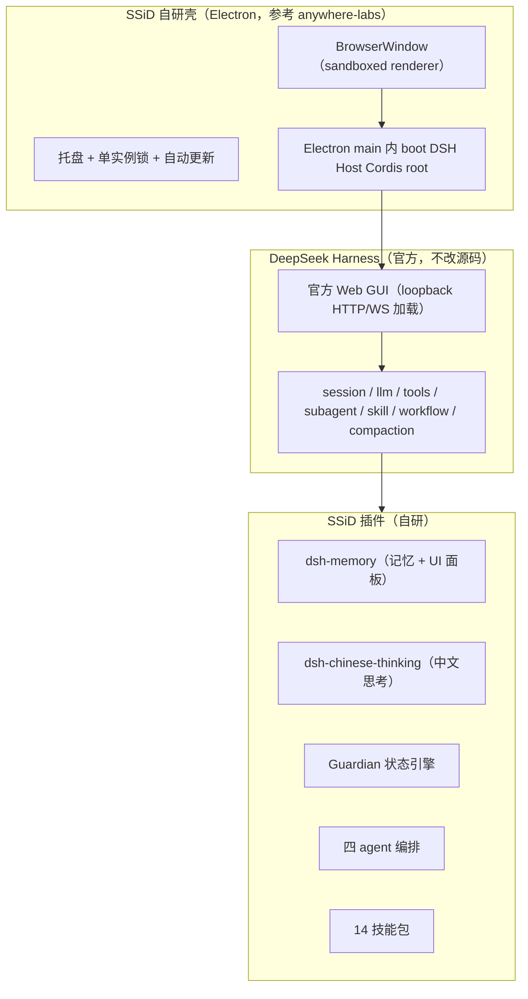
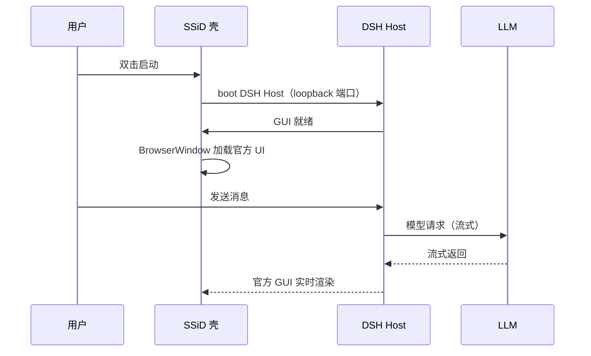

# SSiD（思灵）技术设计方案

> 版本：v0.1
> 日期：2026-08-16
> 状态：定版总纲（本仓库权威设计文档；细分实现见对应子文档）
> 作者：MaxNull（设计） + AI 协作（梳理）
> 前身：fractal（`H:\MaxNull\WorkStation\fractal`，OC 基座版，继续维护兜底）

---

## 〇、方案定位

**SSiD = fractal 的 DSH 基座版**。一句话架构：**DSH 官方 Web GUI + 自研壳 + 插件**。

| 维度 | 定位 |
|---|---|
| 产品名 | 思灵（SSiD，Seek Soul in Darkness） |
| 基座 | DeepSeek Harness（一切皆插件，**不改 DSH 源码**） |
| 形态 | DSH 官方 Web GUI + 自研 Electron 壳 + 插件生态 |
| 引擎 | DeepSeek 唯一 Provider |
| 交付 | 独立安装 exe，开箱即用 |
| 前身关系 | fractal = OC 基座版（继续维护、兜底）；SSiD = DSH 基座版（2.0） |

品牌与命名见 [`../品牌/品牌手册.md`](../品牌/品牌手册.md)。

## 一、背景与决策

### 1.1 三代脉络（家底）

```
cc-gui（Claude Code 桌面 GUI，Tauri2+Vue3+Rust）
   │  设计资产源头：布局/会话/文件/消息/工具栏
   ▼
oc-plus（OpenCode 增强套件）
   │  双星四 agent + 分形 Guardian（六触发线+三层记忆）+ 14 技能 + agents-priority + MCP
   ▼
fractal（oc-gui，Electron + OC serve）
   │  = cc-gui 设计资产 + oc-plus 增强 + Electron 壳 + 自有面板
   ▼
SSiD（思灵，DSH 基座）
   = DSH 官方 GUI + 自研壳 + 插件
```

完整资产清单见 [`2026-08-16-fractal资产详细盘点.md`](2026-08-16-fractal资产详细盘点.md)。

### 1.2 核心决策：押注 DSH —— 换「基座形态」，不是换「引擎」

08-14 曾否决「切引擎」（fractal 壳保留、把 OC serve 换成 DSH 引擎适配器），因 DSH 的 ACP/SDK 是 automation-only，喂不饱富 GUI。

08-16 重新审视，正确思路是**换基座形态**：

| | 旧思路（已否决） | 新思路（已决策） |
|---|---|---|
| 形态 | fractal 壳 + DSH 引擎适配器 | DSH 官方 GUI + 自研壳 + 插件 |
| 要求 | DSH 的 ACP/SDK 够富 | DSH 官方 GUI 本体 + 插件扩展点 |
| 性质 | 把 DSH 当引擎被消费 | 把 fractal 的功能做成插件进 DSH |

**关键认知**：DSH 不是「引擎」（像 OC serve 那样被消费），而是「自带完整富 GUI 的乐高基座」。所以不是「把 DSH 塞进 fractal 壳」，而是「把 fractal 的功能做成插件塞进 DSH」。

决策依据见 [`../决策/2026-08-16-分形DSH迁移-重评估映射表.md`](../决策/2026-08-16-分形DSH迁移-重评估映射表.md)。

### 1.3 三条护栏（防呆，非口号）

1. **fractal（OC 版）继续维护、继续交付**，作为稳定兜底，不因押注 DSH 而停更。
2. **渐进迁移**：按「三分类」逐项搬，不一次性 all-in。
3. **退出条件**：若 DSH 长期无 tagged release 导致反复重写、或关键能力缺失且无法用插件补齐，回到 OC 基座，fractal 壳保留。

## 二、架构设计

### 2.1 整体数据流



### 2.2 关键设计决策（S 系列）

| # | 决策 | 理由 |
|---|---|---|
| S1 | 基座 = DeepSeek Harness，**绝不 fork/patch 源码** | 随 DSH 快速升级；继承 fractal 的 D14 纪律 |
| S2 | 形态 = 官方 GUI + 自研壳 + 插件（非切引擎） | DSH 官方 GUI 已覆盖富交互，无需自研前端 |
| S3 | 壳 = **自研**（Electron，参考 anywhere-labs 架构，不换皮） | 品牌独立；anywhere-labs 只作验证 + 架构参考 |
| S4 | 引擎 = DeepSeek 唯一 Provider | 延续 fractal D13/D16（国产、单 Provider 收窄） |
| S5 | 迁移 = 渐进式，fractal 兜底 | 护栏 1/2，避免 all-in 风险 |
| S6 | 记忆 = dsh-memory（已做）+ 补 UI 面板 + Guardian 触发线 | 已实测 DSH 扩展点可承载 |
| S7 | 四 agent = agent-presets + subagent 重写 | DSH 原生 subagent，编排是配置非底层开发 |
| S8 | 14 技能 = DSH skill 机制打包 | DSH 原生 skill，技能内容可整体迁移 |
| S9 | 插件接入 = 标准 dsh.bundle + dsh.client | anywhere-labs 证实：第三方插件零改造进壳 |
| S10 | 配置 = DSH settings + file provider（agent 可自改） | 对应 fractal「配置即文件」设计 |
| S11 | 品牌 = 思灵/SSiD + Si 瞳孔 logo | 见品牌手册 |

### 2.3 壳的定位（自研，不换皮）

- **anywhere-labs 只作两件事**：① M0 闭环验证的参考样本；② 架构参考（Electron 起 Host + loopback 加载官方 UI + 托盘）。
- **SSiD 壳自研**：单实例锁、起 Host、loopback 加载、托盘、自动更新、打包，代码自写，承载思灵品牌。
- 壳实现细节见 [`2026-08-16-桌面壳最小闭环-搭建步骤.md`](2026-08-16-桌面壳最小闭环-搭建步骤.md)。

## 三、迁移映射（三代资产 → DSH）

### 3.1 结论

| 项 | 值 |
|---|---|
| 三代资产总量 | ≈ 50 功能 |
| DSH 原生覆盖 | ≈ 70%（会话/消息/工具/权限/配置/时间线/国际化/技能/MCP/压缩） |
| 增量工作 | 收敛为 **5 块** |

### 3.2 增量 5 块

| # | 增量 | DSH 落点 | 里程碑 |
|---|---|---|---|
| 1 | 自研壳 | Electron + loopback | M4 |
| 2 | 记忆 UI 面板 + Guardian 状态 | dsh-memory 补 remote+UI + 触发线重做 | M1 + M2 |
| 3 | 四 agent 编排 | agent-presets + subagent | M3 |
| 4 | 14 技能包 | skill 机制 | M3（并行） |
| 5 | 零散面板（诊断/PDF 转换等） | 自研插件 | M4 后 |

完整映射表见 [`2026-08-16-三代资产完整迁移对照表.md`](2026-08-16-三代资产完整迁移对照表.md)。

## 四、模块设计

### 4.1 自研壳（M4）

- 参考 anywhere-labs：Electron main 内 boot DSH Host，绑定 loopback HTTP/WS，sandboxed renderer 加载官方 UI。
- 品牌落地：Si 瞳孔 logo（应用 + 托盘图标）、窗口标题「思灵」、主题命名（深渊/巨鲸之眼）。
- 托盘：profile 切换、模式切换、打开终端、检查更新。

### 4.2 记忆（M1 + M2）

**M1 · 记忆 UI 面板**（施工图见 [`2026-08-16-记忆UI面板-实现设计.md`](2026-08-16-记忆UI面板-实现设计.md)）：

```
浏览器 UI 面板 → Typert RPC（remote.memory）→ MemoryGateway（dsh-memory 内新增）
  → ctx.memory（MemoryEngine）→ 两层 JSON 存储
```

- host 侧：dsh-memory 加 `MemoryGateway extends TypertRemoteService`，暴露 `list/search/confirm/forget`（已核实 Typert 三包 npm 公开可接入）。
- client 侧：注册设置页 tab，`MemorySettingsTab` 组件（三态 + 搜索 + 卡片 + 确认/删除）。

**M2 · Guardian 状态引擎**（重做）：

- 把 fractal 六触发线映射到 DSH：`session/event`（触发线 1/2/4）+ `session-title`/git（触发线 5）+ 哨兵分类器（独立 flash 调用）。
- 状态存储复用 dsh-memory 的两层 storage 思路；状态面板 UI 复用 M1 的 remote+slot 模式。
- 触发线 6（行为前门）已废弃（prompt 污染教训），不迁；触发线 3 由 DSH 原生 compaction 覆盖。

### 4.3 四 agent 编排（M3）

fractal 双星系统 → DSH：

| fractal agent | DSH 落点 |
|---|---|
| 双星（primary，temp 0.2） | 主 agent preset |
| 工匠（subagent，temp 0.1，带 LSP） | subagent + LSP capability |
| 参谋（subagent，temp 0.7，战术纠偏） | subagent |
| 军师（subagent，temp 0.3，战略审查） | subagent |

四阶段流程（研究→综合→实现→验证）由主 agent 编排逻辑实现，DSH 的 subagent 是原生能力。

### 4.4 14 技能包（M3 并行）

8 个 mxy-*（编码工作流）+ 6 个 omo-*（研发增强）→ DSH `skill` 机制打包。技能内容（prompt/步骤）可整体迁移，机制从 OC skill 换成 DSH skill。

### 4.5 零散面板（M4 后）

诊断面板（日志三 tab）、PDF 转换、文件修改卡片、上下文面板等——逐一评估「原生有/自研」，按需做成插件。

## 五、关键流程

### 5.1 启动 → 对话



### 5.2 记忆读写

```
模型 memory_save → dsh-memory → storage（suggested）
用户 UI 面板确认 → remote.memory.confirm → status: auto → 每轮 recall context
```

### 5.3 子代理编排

```
主 agent 拆解 → subagent（工匠 ×N 并行）→ 综合 → 实现 → 军师审查 → 汇报
```

## 六、路线图（M0–M4）

| 里程碑 | 目标 | 前置 | 验收要点 |
|---|---|---|---|
| M0 闭环验证 | DSH GUI + 壳 + 2 插件跑通 | 无 | 中文思考生效 + memory 5 工具可用 |
| M1 记忆 UI 面板 | dsh-memory 补图形界面 | M0 | 设置页能列表/搜索/确认/删除 |
| M2 Guardian 状态 | 触发线监控搬到 DSH | M1 | 断言计数/审查队列可视化 |
| M3 四 agent + 技能 | 编排 + 14 技能 | M2（可并行） | 四 agent 协作 + 技能可调 |
| M4 自研壳 | 思灵品牌 exe | M0 长期验证 | 品牌安装包，非换皮 |

详见 [`2026-08-16-分阶段路线图.md`](2026-08-16-分阶段路线图.md)。

## 七、品牌规范（摘要）

- 中文名「思灵」、英文「Seek Soul in Darkness」、缩写「SSiD」。
- 主标语「于黑暗中，探寻灵魂。」副标语「以思为引，以灵为眸。」
- Logo：Si 原子结构 + 瞳孔（虹膜 + 瞳孔 + 高光）。
- 主色 #0A0E14，微光青 #4FC3F7。

全文见 [`../品牌/品牌手册.md`](../品牌/品牌手册.md)。

## 八、风险与护栏

| 风险 | 应对 |
|---|---|
| DSH 无 tagged release（唯一硬风险） | 护栏 3：退出条件 + 渐进迁移 |
| 壳停更/漂移 | 自研壳不依赖第三方壳；只参考架构 |
| Typert 外部接入 | 已核实可行（三包 npm 公开）；备选宿主行内 |
| 迁移工作量 | 70% 原生覆盖，增量收敛 5 块，按 M0→M4 排期 |

## 九、文档索引

| 主题 | 文档 |
|---|---|
| 迁移决策 + 映射 | [`../决策/2026-08-16-分形DSH迁移-重评估映射表.md`](../决策/2026-08-16-分形DSH迁移-重评估映射表.md) |
| 壳选型 | [`../决策/2026-08-16-桌面壳选型-评估结论.md`](../决策/2026-08-16-桌面壳选型-评估结论.md) |
| 三代完整映射 | [`2026-08-16-三代资产完整迁移对照表.md`](2026-08-16-三代资产完整迁移对照表.md) |
| 三代详细盘点 | [`2026-08-16-fractal资产详细盘点.md`](2026-08-16-fractal资产详细盘点.md) |
| 路线图 | [`2026-08-16-分阶段路线图.md`](2026-08-16-分阶段路线图.md) |
| 记忆 UI 设计 | [`2026-08-16-记忆UI面板-实现设计.md`](2026-08-16-记忆UI面板-实现设计.md) |
| 壳步骤 | [`2026-08-16-桌面壳最小闭环-搭建步骤.md`](2026-08-16-桌面壳最小闭环-搭建步骤.md) |
| 品牌 | [`../品牌/品牌手册.md`](../品牌/品牌手册.md) |
